# bet-store Ứng dụng mua bán rao vặt

Ứng dụng là nơi kết nối các bạn sinh viên có nhu cầu mua bán, trao đổi hàng hóa như quần áo, đồ ăn, ...

## Nội dung
1. [Chức năng](#chức-năng)
    
    1. [Đăng nhập / Đăng kí](#đăng-nhập-/-đăng-kí)
    
    1. [Tìm kiếm sản phẩm](#tìm-kiếm-sản-phẩm)
    
    1. [Sắp xếp sản phẩm](#sắp-xếp-sản-phẩm)
    
    1. [Xem thông tin sản phẩm](#xem-thông-tin-sản-phẩm)
    
    1. [Xem danh sách danh mục](#xem-danh-sách-danh-mục)
    
    1. [Liên lạc với người bán](#liên-lạc-với-người-bán)
    
    1. [Nạp tiền](#nạp-tiền)
    
    1. [Quản lý sản phẩm rao bán](#quản-lý-sản-phẩm-rao-bán)
    
    1. [Quản lý thông tin cá nhân](#quản-lý-thông-tin-cá-nhân)
    
    1. [Quản lý các danh mục](#quản-lý-các-danh-mục)
    
1. [Yêu cầu thiết bị](#yêu-cầu-thiết-bị)

1. [Thư viện và công nghệ](#thư-viện-và-công-nghệ)

1. [Tác giả](#tác-giả)

1. [Giấy phép](#giấy-phép)

## Chức năng
### Đăng nhập / Đăng kí
   * Đăng nhập
 
   * Đăng kí
   
   

   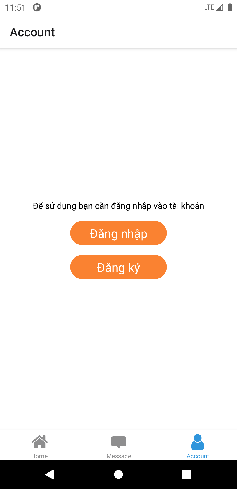
   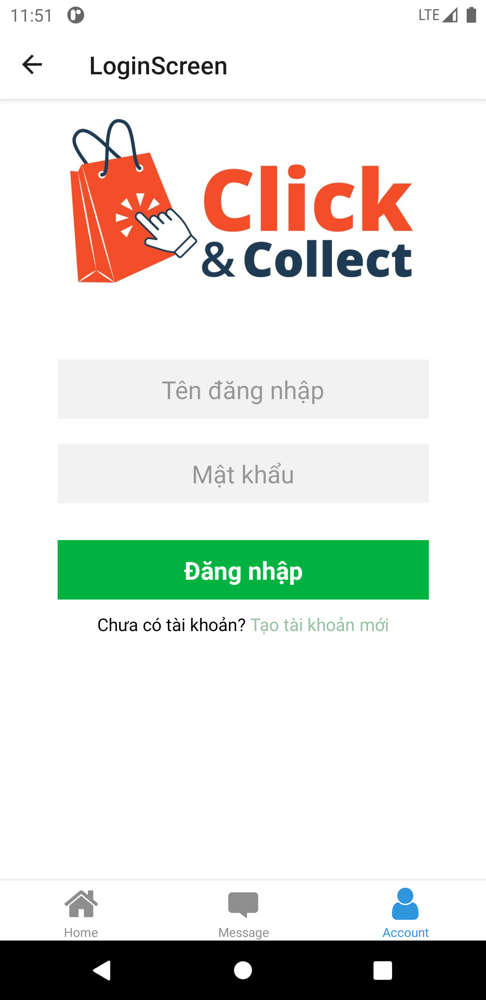 
   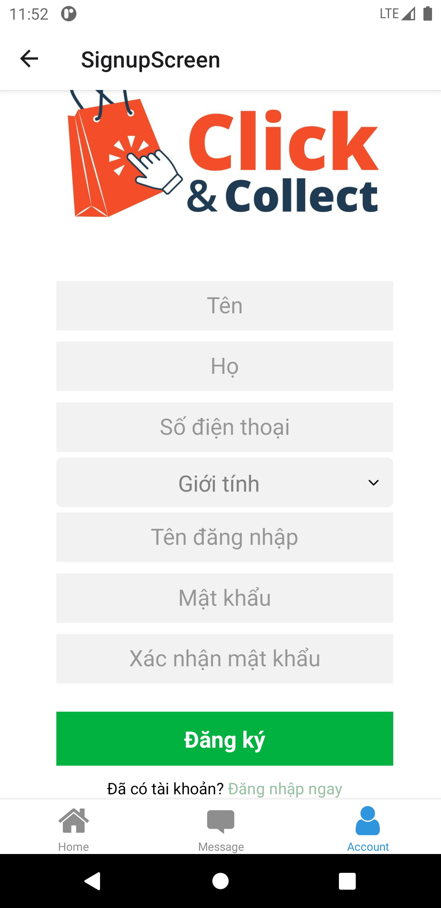
   

   
### Tìm kiếm sản phẩm
   * Tìm kiếm theo tên
   
   

   
   

### Sắp xếp sản phẩm

   

### Xem thông tin sản phẩm
   * Xem thông tin chi tiết của sản phẩm
   * Liên lạc người bán nếu muốn
   
   

   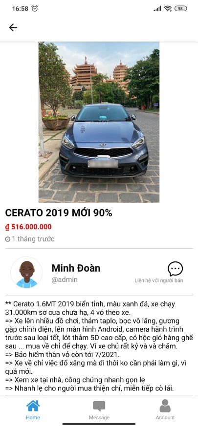
   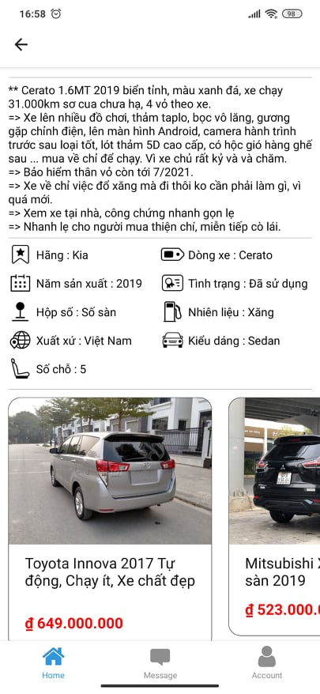 
   

### Xem danh sách danh mục
   * Danh sách các danh mục mua bán
   
   

   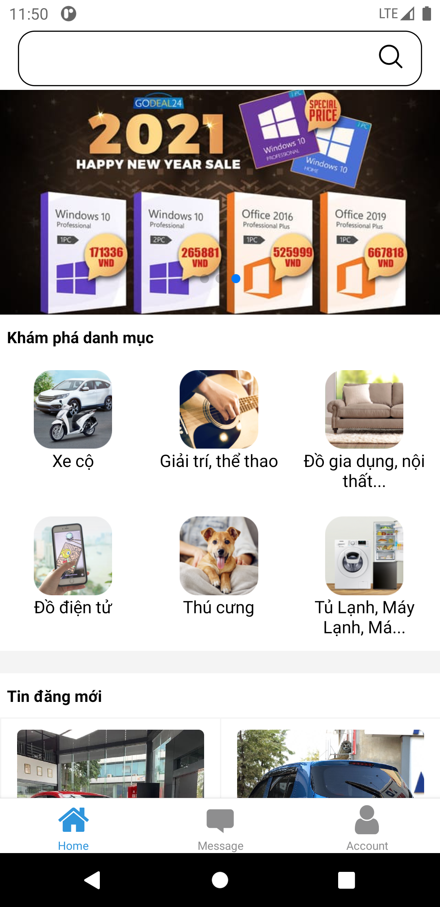
   

### Liên lạc với người bán
   * Liên hệ với người bán để trao đổi thông tin và mua hàng
   
   

   
   
   

   
### Nạp tiền
   * Nạp tiền qua momo
   
   

   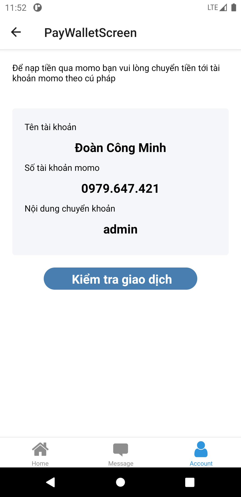
   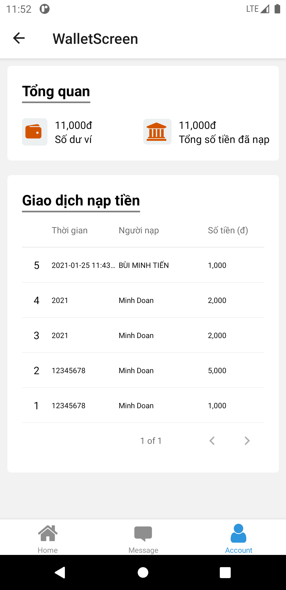
   

### Quản lý sản phẩm rao bán
   * Thêm sản phẩm mới
   
   * Sửa thông tin sản phẩm
   
   * Xóa sản phẩm
   
   

   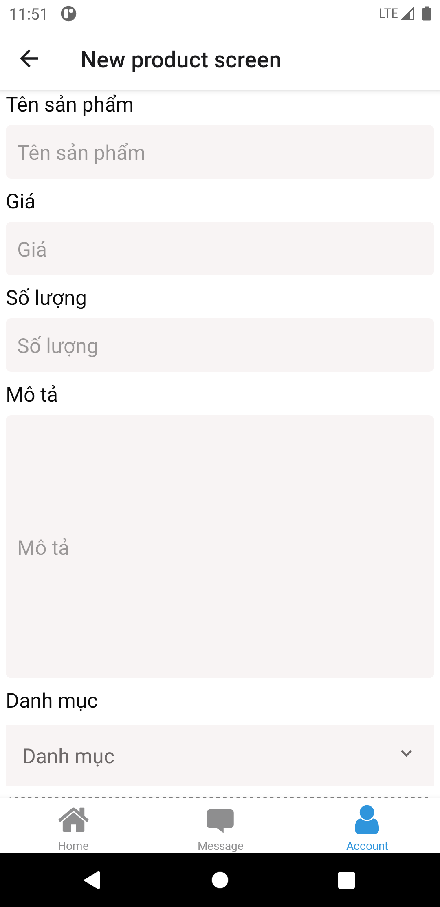
   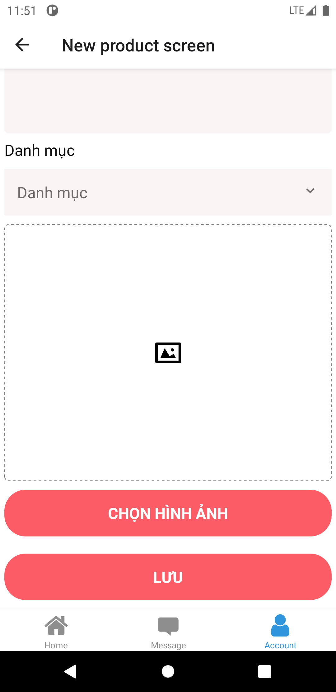
   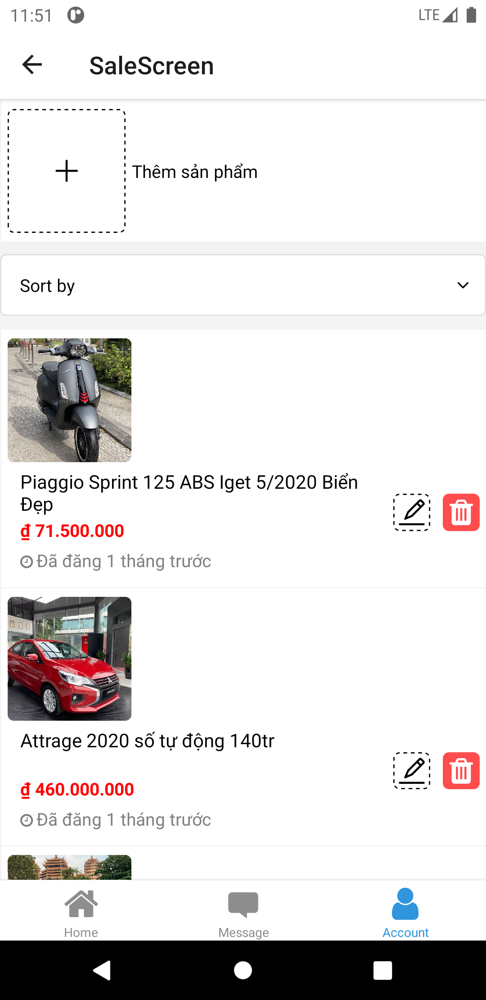
   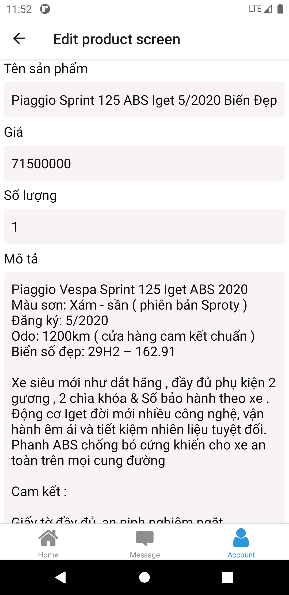
   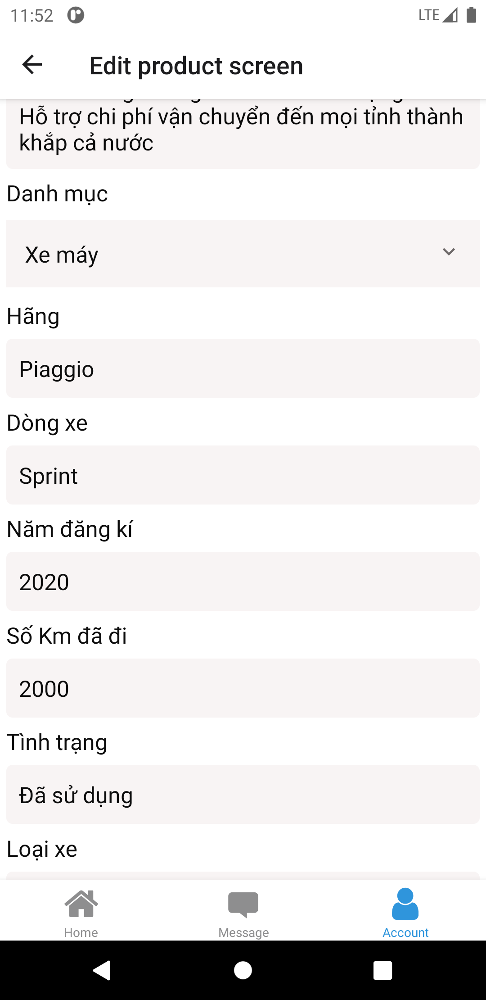
   

### Quản lý thông tin cá nhân
   * Cập nhật thông tin
   
   * Đổi mật khẩu
   
   

   
   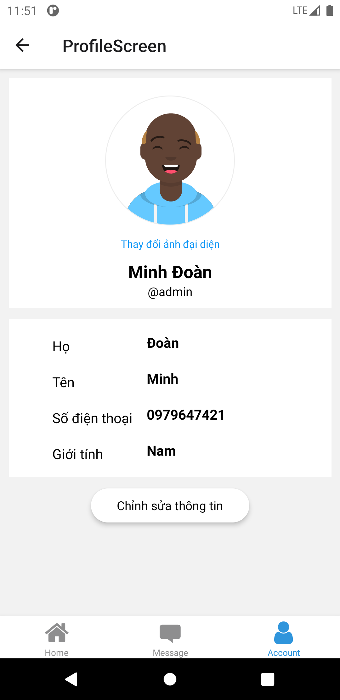
   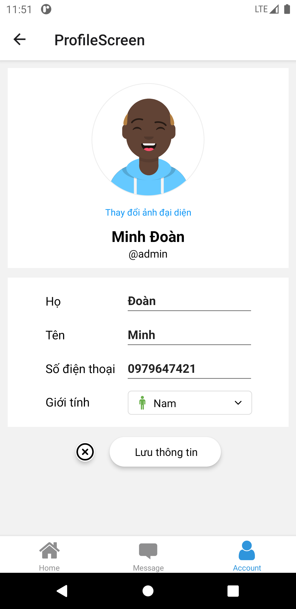
   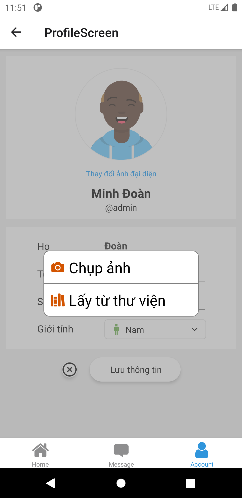
   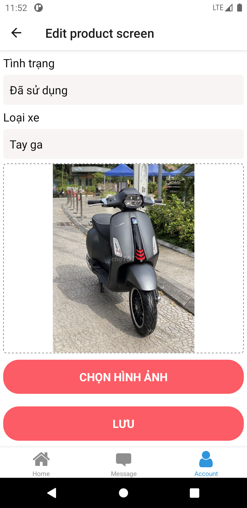
   

### Quản lý các danh mục

## Yêu cầu thiết bị

-Android:

   +Android studio : 

   +Gradle : 

   +Min sdk : 

   +Target sdk : 

## Thư viện và công nghệ

- Language : 

- FrameWork : 

- Database: 

## Tác giả ứng dụng mobile
 - Đoàn Công Minh - 18521092@gm.uit.edu.vn
 - Nguyễn Thị Lan Phương - 16520972@gm.uit.edu.vn

## Giấy phép

  Copyright (C) 2002-2020 Igor Sysoev
  Copyright (C) 2011-2020 Nginx, Inc.
  All rights reserved.
 
  Redistribution and use in source and binary forms, with or without
  modification, are permitted provided that the following conditions
  are met:
  1. Redistributions of source code must retain the above copyright
     notice, this list of conditions and the following disclaimer.
  2. Redistributions in binary form must reproduce the above copyright
     notice, this list of conditions and the following disclaimer in the
     documentation and/or other materials provided with the distribution.
 
 THIS SOFTWARE IS PROVIDED BY THE AUTHOR AND CONTRIBUTORS ``AS IS'' AND
 ANY EXPRESS OR IMPLIED WARRANTIES, INCLUDING, BUT NOT LIMITED TO, THE
 IMPLIED WARRANTIES OF MERCHANTABILITY AND FITNESS FOR A PARTICULAR PURPOSE
 ARE DISCLAIMED.  IN NO EVENT SHALL THE AUTHOR OR CONTRIBUTORS BE LIABLE
 FOR ANY DIRECT, INDIRECT, INCIDENTAL, SPECIAL, EXEMPLARY, OR CONSEQUENTIAL
 DAMAGES (INCLUDING, BUT NOT LIMITED TO, PROCUREMENT OF SUBSTITUTE GOODS
 OR SERVICES; LOSS OF USE, DATA, OR PROFITS; OR BUSINESS INTERRUPTION)
 HOWEVER CAUSED AND ON ANY THEORY OF LIABILITY, WHETHER IN CONTRACT, STRICT
 LIABILITY, OR TORT (INCLUDING NEGLIGENCE OR OTHERWISE) ARISING IN ANY WAY
 OUT OF THE USE OF THIS SOFTWARE, EVEN IF ADVISED OF THE POSSIBILITY OF
 SUCH DAMAGE.
 
   
